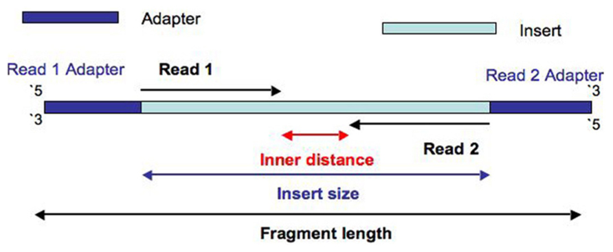
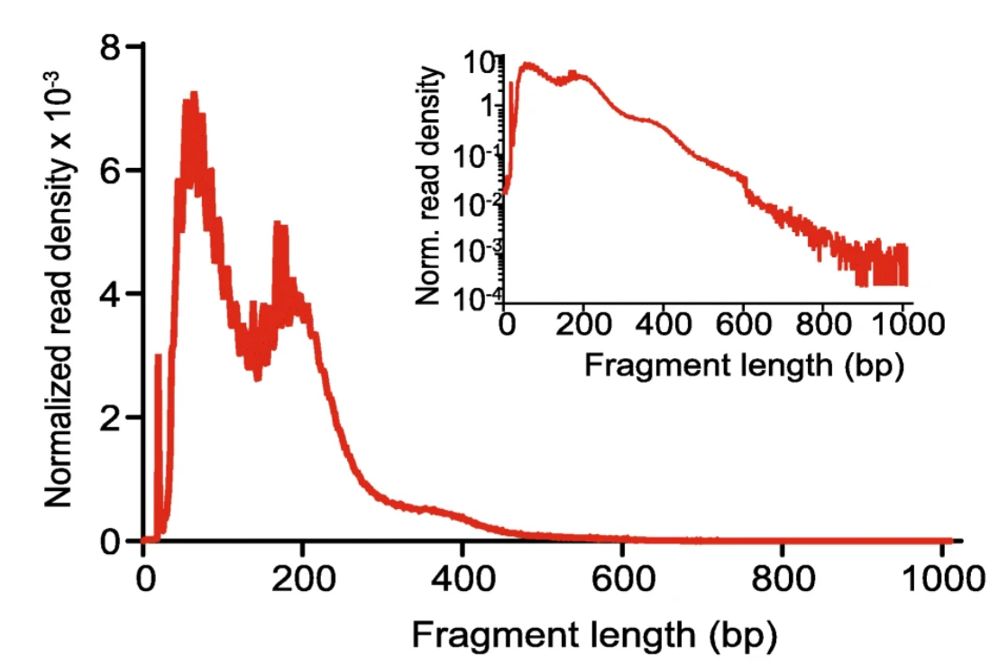

```{r setup, include=FALSE}
knitr::opts_chunk$set(
  echo = TRUE, 
  dpi = 300,
  fig.align = "center", 
  fig.width = 7, 
  fig.height = 4,
  eval = FALSE
)
```


## Introduction 

In this practical exercise, we are going to see the necessary tools and steps to analyze ATAC-seq data from raw data. Instead of starting from raw reads as we did in the bulk RNA-seq practice, we are going to use an already aligned sample. The first steps (checking quality of reads and trimming adapters and low quality bases) are the same to the ones we used but adapting some parameters to the data we have. Particularly, it is important to remember that in ATAC-seq we have paired-end and longer reads. As we have seen in the theory part, the main steps to analyze ATAC-seq from raw data are: 

1. Trimming of adapters and low quality bases/reads.
3. Mapping.
4. Filtering mapped reads: removing uninformative and duplicated reads. 
5. Peak calling.
6. Visualization of coverage.
4. Quantification: quantifying the number of reads (how accessible a genomic region is) within each defined peak. 

As usual, we are going to use the workflow I follow, but there are alternative software packages. We will comment on them throughout the exercise. 

## Data to be analyzed

For this analysis, we are going to start from a BAM file of a sample from [this paper](https://www.nature.com/articles/ng.3646). The dataset comprises ATAC-seq profiles of hematopoietic and leukemic cell types. In particular, we are going to analyze the sample corresponding to the [SRR2920494](https://trace.ncbi.nlm.nih.gov/Traces/index.html?run=SRR2920494) SRA number. Again, this is a downsampled version to make computations quicker.

## Structuring the project

As we did in the bulk RNA-seq practice, let's structure the directories:

```{bash}
01-data/ 
├── aligned.data
│   ├── Filt0.Raw
│   │   └── qc.metrics
│   ├── Filt1.Dup
│   │   └── qc.metrics
│   ├── Filt2.MAPQ
│   │   └── qc.metrics
│   ├── Filt3.mtDNA
│   │   └── qc.metrics
│   ├── Filt4.blacklist
│   │   └── qc.metrics
│   └── multiqc.output
├── bigWig.files
├── MACS3
├── processed.data
│   └── multiqc.output
└── raw.data
```

## Workflow

### Filtering mapped reads

First, we need to filter the mapped reads according to different criteria. In ATAC-seq, we usually use the following filters: 

1. Keep only those reads with a mapped with a quality higher than 30 MAPQ.
2. Remove those reads aligning to mitochondrial DNA.
3. Removing reads aligning to a set of blacklisted regions provided by ENCODE: <https://www.nature.com/articles/s41598-019-45839-z>. 
4. Remove duplicated reads.

After each filtering step, we are going to check how many reads have been discarded + compute quality controls using `samtools`.

**Note**: here, we are learning how to use these tools. However, whenever you have a greater number of samples to process, you probably imagine that doing things like this is not sustainable. The good practice would be to implement a pipeline using bash, NextFlow or any other workflow manager and run the same scripts on different samples. 

```{bash}
conda activate atac-seq-env
## to make the code a bit cleaner, let's define some variables in the terminal session
ALIGN_READS_FILT0='aligned.data/Filt0.Raw'
ALIGN_READS_FILT0_QC='aligned.data/Filt0.Raw/qc.metrics'
ALIGN_READS_FILT1='aligned.data/Filt1.Dup'
ALIGN_READS_FILT1_QC='aligned.data/Filt1.Dup/qc.metrics'
ALIGN_READS_FILT2='aligned.data/Filt2.MAPQ'
ALIGN_READS_FILT2_QC='aligned.data/Filt2.MAPQ/qc.metrics'
ALIGN_READS_FILT3='aligned.data/Filt3.mtDNA'
ALIGN_READS_FILT3_QC='aligned.data/Filt3.mtDNA/qc.metrics'
ALIGN_READS_FILT4='aligned.data/Filt4.blacklist'
ALIGN_READS_FILT4_QC='aligned.data/Filt4.blacklist/qc.metrics'
sname='SRR2920494_down'
THS=6
```


#### 1 - Removing duplicated reads

We use `picard` to mark and remove those reads duplicated in a BAM file. In ATAC-seq, we want reads that have been originated from a single fragment of DNA, and therefore duplicates are assumed to be a product of PCR amplification. In RNA-seq, we couldn't remove these reads because we cannot differentiate between PCR artifacts and identical transcripts. However, in this case we are not measuring RNA copies, and we can assume that duplicates come from the same DNA fragment. 

```{bash}
## 1 - sorting and indexing raw BAM
samtools sort -@ $THS -o $ALIGN_READS_FILT0/$sname.filt.0.genome.sorted.bam \
    $ALIGN_READS_FILT0/${sname}_mod.bam 
samtools index -@ $THS -b $ALIGN_READS_FILT0/$sname.filt.0.genome.sorted.bam \
    $ALIGN_READS_FILT0/$sname.filt.0.genome.sorted.bam.bai

## 2 - Marking and removing duplicates
picard MarkDuplicates \
    I=$ALIGN_READS_FILT0/$sname.filt.0.genome.sorted.bam \
    O=$ALIGN_READS_FILT1/$sname.filt.1.genome.unique.bam \
    M=$ALIGN_READS_FILT1_QC/$sname.marked.dup.metrics.all.txt \
    REMOVE_DUPLICATES=TRUE 

samtools index -@ $THS -b $ALIGN_READS_FILT1/$sname.filt.1.genome.unique.bam \
    $ALIGN_READS_FILT1/$sname.filt.1.genome.unique.bam.bai
```

#### 2 - Filtering BAMs using quality

Aligners cannot always assign a read to a specific genomic region with high confidence. Depending on the sequence, reads can get mapped to different genomic regions, a problem very typical of short sequence-based methodologies. `Bowtie2` tries to prioritize these cases assigning a score for the degree of confidence: $Q = -log10(p)$, where $p$ is the probability that the alignment does not correspond to the read's true point of origin. This is recorded in the MAPQ field in SAM/BAM files. With `samtools`, we are going to use these information to remove reads with a MAPQ less than 30. 

```{bash}
## 1 - Filtering BAMs using mapping quality score
samtools view -@ $THS -b -q 30 \
    -o $ALIGN_READS_FILT2/$sname.filt.2.genome.unsorted.bam \
    $ALIGN_READS_FILT1/$sname.filt.1.genome.unique.bam

samtools sort -@ $THS \
    -o $ALIGN_READS_FILT2/$sname.filt.2.genome.sorted.bam \
    $ALIGN_READS_FILT2/$sname.filt.2.genome.unsorted.bam

samtools index -@ $THS \
    -b $ALIGN_READS_FILT2/$sname.filt.2.genome.sorted.bam \
    $ALIGN_READS_FILT2/$sname.filt.2.genome.sorted.bam.bai

rm $ALIGN_READS_FILT2/$sname.filt.2.genome.unsorted.bam
```

#### 3 - Removing mitochondrial reads

Mitochondrial genome is nucleosome-free, which leads to showing a high number of Tn5 insertions. In ATAC-seq, we cannot infer anything from mitochondrial DNA, so we need to discard those reads aligning to those regions. 

```{bash}
## 3 - Removing mitochondrial reads
## in this step, I'm going to remove not just MT reads, but also non-canonical chromosomes and Y chromosome
## NOTE: this will depend on how chromosomes are named: with or without chr
samtools idxstats $ALIGN_READS_FILT2/$sname.filt.2.genome.sorted.bam | cut -f 1 | grep -E '^(1|2|3|4|5|6|7|8|9|10|11|12|13|14|15|16|17|18|19|X)' | xargs samtools view -b $ALIGN_READS_FILT2/$sname.filt.2.genome.sorted.bam | samtools sort -@ $THS -o $ALIGN_READS_FILT3/$sname.filt.3.no_chrM.sorted.bam 

samtools index -@ $THS \
    -b $ALIGN_READS_FILT3/$sname.filt.3.no_chrM.sorted.bam \
    $ALIGN_READS_FILT3/$sname.filt.3.no_chrM.sorted.bam.bai
```

#### 4 - Removing backlisted regions 

These are regions that have been defined as problematic by ENCODE in [this paper](https://www.nature.com/articles/s41598-019-45839-z). It is a very common practice to remove them when analyzing ATAC-seq, so that we void the possibility to find artifacts in downstream steps. They can be found here for different genome versions and organisms: <https://github.com/Boyle-Lab/Blacklist>. In our case, we need to download the `hg38-blacklist.v2.bed.gz` file, as I used the hg38 genome version in the mapping step. Then, we need to uncompress it using `gzip -d`.

```{bash}
## 4 - Filtering blacklisted genome regions (from ENCODE)
samtools view -@ $THS -b -L hg38-blacklist.v2.bed \
    -U $ALIGN_READS_FILT4/$sname.filt.4.filtered.unsorted.bam \
    $ALIGN_READS_FILT3/$sname.filt.3.no_chrM.sorted.bam > $ALIGN_READS_FILT4/$sname.filt.4.blacklisted.bam

## 6 - Sorting filtered reads and erase unsorted
samtools sort -@ $THS $ALIGN_READS_FILT4/$sname.filt.4.filtered.unsorted.bam > $ALIGN_READS_FILT4/$sname.filt.4.filtered.sorted.bam
rm $ALIGN_READS_FILT4/$sname.filt.4.filtered.unsorted.bam 

samtools index -@ $THS -b $ALIGN_READS_FILT4/$sname.filt.4.filtered.sorted.bam \
    $ALIGN_READS_FILT4/$sname.filt.4.filtered.sorted.bam.bai
```


### Computing quality metrics

You can notice that we are storing each intermediate BAM file. Now, these files are not very heavy as we are only analyzing one sample, but you can imagine that this can escalate very easily. Here, we are doing it like this to compute some quality metrics in each step, but whenever you build up an actual pipeline, take this into consideration or it is likely you may have storage issues. 

For each of these steps, we are going to compute the following metrics: 

* Total number of reads.
* Quality of alignment (MAPQ scores).
* Insert size: this is the distance between the r1 AND r2 read pairs. In the end, it tells us the size of the DNA fragment the read pairs came from. This is important to determine the quality of the ATAC-seq (see below).

#### Total number of reads

```{bash}
## raw bam file
samtools flagstat -@ $THS $ALIGN_READS_FILT0/$sname.filt.0.genome.sorted.bam > $ALIGN_READS_FILT0_QC/$sname.filt.0.flagstat-results.txt

## no duplicates bam file
samtools flagstat -@ $THS $ALIGN_READS_FILT1/$sname.filt.1.genome.unique.bam > $ALIGN_READS_FILT1_QC/$sname.filt.1.flagstat-results.txt 

## no low quality alignments
samtools flagstat -@ $THS $ALIGN_READS_FILT2/$sname.filt.2.genome.sorted.bam > $ALIGN_READS_FILT2_QC/$sname.filt.2.flagstat-results.txt 

## no MT reads
samtools flagstat -@ $THS $ALIGN_READS_FILT3/$sname.filt.3.no_chrM.sorted.bam > $ALIGN_READS_FILT3_QC/$sname.filt.3.flagstat-results.txt

## no blacklisted regions
samtools flagstat -@ $THS $ALIGN_READS_FILT4/$sname.filt.4.filtered.sorted.bam > $ALIGN_READS_FILT4_QC/$sname.filt.4.flagstat-results.txt 
```

#### Quality of alignment

This computes some quality metrics about the alignment. The command requires the FASTA file used to map the reads, so don't run this code, I will provide you with the output. 

```{bash}
picard CollectAlignmentSummaryMetrics \
    R=/data_lab_DSM/References/Human/GRCh38.p14/Raw.data/Homo_sapiens.GRCh38.dna.primary_assembly.fa \
    I=$ALIGN_READS_FILT0/$sname.filt.0.genome.sorted.bam \
    O=$ALIGN_READS_FILT0_QC/$sname.filt.0.picard-CASM-results.txt 
    
picard CollectAlignmentSummaryMetrics \
    R=/data_lab_DSM/References/Human/GRCh38.p14/Raw.data/Homo_sapiens.GRCh38.dna.primary_assembly.fa \
    I=$ALIGN_READS_FILT1/$sname.filt.1.genome.unique.bam \
    O=$ALIGN_READS_FILT1_QC/$sname.filt.1.picard-CASM-results.txt 
    
picard CollectAlignmentSummaryMetrics \
    R=/data_lab_DSM/References/Human/GRCh38.p14/Raw.data/Homo_sapiens.GRCh38.dna.primary_assembly.fa \
    I=$ALIGN_READS_FILT2/$sname.filt.2.genome.sorted.bam \
    O=$ALIGN_READS_FILT2_QC/$sname.filt.2.picard-CASM-results.txt 
    
picard CollectAlignmentSummaryMetrics \
    R=/data_lab_DSM/References/Human/GRCh38.p14/Raw.data/Homo_sapiens.GRCh38.dna.primary_assembly.fa \
    I=$ALIGN_READS_FILT3/$sname.filt.3.no_chrM.sorted.bam \
    O=$ALIGN_READS_FILT3_QC/$sname.filt.3.picard-CASM-results.txt 

picard CollectAlignmentSummaryMetrics \
    R=/data_lab_DSM/References/Human/GRCh38.p14/Raw.data/Homo_sapiens.GRCh38.dna.primary_assembly.fa \
    I=$ALIGN_READS_FILT4/$sname.filt.4.filtered.sorted.bam \
    O=$ALIGN_READS_FILT4_QC/$sname.filt.4.filtered.picard-CASM-results.txt 
```


#### Insert size

As we said, this is one of the most important plots to understand if an ATAC-seq has been successful. The idea is to check the distribution of distances between R1 and R2 reads (see figure below).




Why is this important? Because it tells us the size of the original DNA fragments, which in ATAC-seq is translated into the distance between Tn5 insertions. Considering that the tagmentase is going to introduce these insertions with a higher probability in chromatin accessible regions, we can infer if at the moment of insertion, that genomic region was free-nucleosome (no nucleosomes at all), mono-nucleosome (1 nucleosome, which is translated into a DNA fragment size of around 148pb) bi-nucleosome, etc. As during tagmentase we expect to find more Tn5 insertions in those regions with no nucleosomes, a successful ATAC-seq should show a higher number of DNA fragments coming from free-nucleosome regions. In practice, we should see a insert size distribution like this: 



Depending on the experimental protocol, this distribution may be different. Even depending on the chromatin compaction of the cell type analyzed, this can also be different. Anyhow, this plot helps understand the data, and as a standard we should see something similar to the figure above. Let's run the `CollectInsertSizeMetrics` command from `picard`: 

```{bash}
picard CollectInsertSizeMetrics \
    I=$ALIGN_READS_FILT0/$sname.filt.0.genome.sorted.bam \
    H=$ALIGN_READS_FILT0_QC/$sname.filt.0.histogram.pdf \
    O=$ALIGN_READS_FILT0_QC/$sname.filt.0.picard-CISM-results.txt 
    
picard CollectInsertSizeMetrics \
    I=$ALIGN_READS_FILT1/$sname.filt.1.genome.unique.bam \
    H=$ALIGN_READS_FILT1_QC/$sname.filt.1.histogram.pdf \
    O=$ALIGN_READS_FILT1_QC/$sname.filt.1.picard-CISM-results.txt 

picard CollectInsertSizeMetrics \
    I=$ALIGN_READS_FILT2/$sname.filt.2.genome.sorted.bam \
    H=$ALIGN_READS_FILT2_QC/$sname.filt.2.histogram.pdf \
    O=$ALIGN_READS_FILT2_QC/$sname.filt.2.picard-CISM-results.txt 
    
picard CollectInsertSizeMetrics \
    I=$ALIGN_READS_FILT3/$sname.filt.3.no_chrM.sorted.bam \
    H=$ALIGN_READS_FILT3_QC/$sname.filt.3.histogram.pdf \
    O=$ALIGN_READS_FILT3_QC/$sname.filt.3.picard-CISM-results.txt 

picard CollectInsertSizeMetrics \
    I=$ALIGN_READS_FILT4/$sname.filt.4.filtered.sorted.bam \
    H=$ALIGN_READS_FILT4_QC/$sname.filt.4.filtered.histogram.pdf \
    O=$ALIGN_READS_FILT4_QC/$sname.filt.4.filtered.picard-CISM-results.txt
```


#### Using `MultiQC` to summarize results 

Now, we can use `MultiQC` to summarize some of the information that we have generated with the previous commands: 

```{bash}
multiqc aligned.data -o aligned.data/multiqc.output
```

Explore the generated report and the files generated at each of the previous steps. 


### Peak calling using `MACS3`

This is probably the most critical step in ATAC-seq (as well as in other technologies for studying epigenomics, such as ChIP-seq, CUT&TAG, etc). It consists of identifying those genomics regions that are actually open compared with the rest of covered regions. These regions are usually referred to as peaks. The most common tool used for this part is [`MACS3`](https://macs3-project.github.io/MACS/), which indeed was developed for CHiP-seq data. There are also other tools that can be an option, such as [`Genrich`](https://github.com/jsh58/Genrich) or [`hmmratac`](https://github.com/LiuLabUB/HMMRATAC). We will use `MACS3`. 

Regarding the parameters to use for ATAC-seq, there is a lot of discussion about whether using the paired-end information or just using all reads indistinguishably. Also, as it was designed for ChIP-seq data, it provides two peak calling modes: broad peaks, which usually correspond to histone modifications, whereas narrow peaks correspond to TFs. For ATAC-seq, we are interested in specific regions, so we have to choose the narrow mode. 

To my knowledge, the most recommended practice is to use the paired-end mode of MACS3, as it uses the insert size of each pair of reads rather than estimating it. 

```{bash}
macs3 callpeak -f BAMPE \
    -t $ALIGN_READS_FILT4/$sname.filt.4.filtered.sorted.bam \
    -n MACS3/$sname.paired.narrow \
    -g mm -q 0.01 --call-summits
```

This command will generate the following files: `paired.narrow_summits.bed`, `paired.narrow_peaks.narrowPeak` and `paired.narrow_peaks.xls`. The three files contain information about in which genomic region peaks were defined as peaks. Let's explore the `paired.narrow_peaks.narrowPeak` file: 

```{bash}
cat aligned.data/MACS3/SRR2920494_down.paired.narrow_peaks.narrowPeak | head
```

It is a BED6+4 file in which we can find the following information: 

* Chromosome: name of the chromosome (or contig, scaffold, etc.).  
* Chromosome start: the starting position of the feature in the chromosome or scaffold. It is a 0-based indexing. 
* Chromosome end: the ending position of the feature in the chromosome or scaffold.
* Name given to a region. In this case, it is just a unique ID for each peak. 
* Score: indicates how intense the peak will be displayed in a browser (0-1000). In MACS3, it is $-log10(qvalue)*10$
* Strand: `+` or `-` to denote strand or orientation (if applicable). In this case, we cannot know the strand in which the binding (or, in ATAC-seq, the Tn5 insertion) is happening, so it will always be `.`. 
* Signal value: measurement of overall (usually, average) enrichment for the region. In MACS3, these values are the fold-enrichment values compared with the background. This value corresponds to the peak summit, where the enrichment is the highest in the peak region. 
* p-value: measurement of statistical significance (`-log10`).
* q-value: measurement of statistical significance using false discovery rate (`-log10`).
* Peak: point-source called for this peak; 0-based offset from chromosome start. This is the location of the peak summit, where the enrichment is the highest in the peak region. It is the relative location of summit. If the chromStart is 100, and this value is 50, then the peak summit is at 150 (using the BED-style coordination system).


#### Computing FRiP scores

This is another quality metric important to understand ATAC-seq data. It is defined as the fraction of reads in peaks. Therefore, it is the signal-to-noise ratio metric in these data: how many reads we have in regions defined as peaks compared with background. Let's compute it using the `subread` tool as follows:

```{bash}
### covert narrowPeaks to SAF
awk 'BEGIN{FS=OFS="\t"; print "GeneID\tChr\tStart\tEnd\tStrand"}{print $4, $1, $2+1, $3, "."}' MACS3/${sname}.paired.narrow_peaks.narrowPeak > MACS3/${sname}.peaks.saf

### count
featureCounts -p -a MACS3/${sname}.peaks.saf -F SAF \
    -o MACS3/${sname}.FRiP.scores.txt \
    aligned.data/Filt4.blacklist/SRR2920494_down.filt.4.filtered.sorted.bam &> MACS3/${sname}.FRiP.scores.output.txt
```

If you explore the `MACS3/SRR2920494_down.FRiP.scores.output.txt` file, you will find the successfully assigned alignments, which is exactly this information. 

Regarding the values that are expected in ATAC-seq data, according to [ENCODE](https://www.encodeproject.org/atac-seq/): they should be >0.3, which is far from the value we have just obtained. This is normal, as we are working on a downsampled BAM file. 


### Visualizing peaks in IGV

Now, we can visualize these files in IGV. Since the narrowPeak file only contains the location of the peaks + a single intensity value, we cannot know how well supported each peak is (how many reads in each peak are). To explore the coverage, we could load the BAM file (which would be intensive if it is very big or you have many samples) or generate a bigwig file. It is a binary file format commonly used in genomics to store dense, continuous, quantitative data, such as coverage or signal tracks from sequencing experiments. It is highly efficient for visualizing large datasets, as it enables rapid access to specific regions without requiring the entire file to be loaded into memory.

To generate this file, we need to use `deepTools`, a suite to explore genomics data. It also allows to generate signal heatmaps, etc., in a very efficient way. The command is as follows: 

```{bash}
bamCoverage -b aligned.data/Filt4.blacklist/SRR2920494_down.filt.4.filtered.sorted.bam \
    -o bigWig.files/$sname.4.bw --normalizeUsing CPM \
    --numberOfProcessors $THS --exactScaling --centerReads \
    --binSize 1 --outFileFormat bigwig 
```

This will take a while. In the mean time, open IGV and load the narrowPeak and BAM files and start exploring some peaks. To go to loci where there are significant peaks, you can explore some specific genes where there should be signal in the promoter region or you can check the narrowPeak file to go to specific regions. Remember that these data come from human cells!

### Accessibility quantification in peaks

This is the last step of this practical exercise. It consists of estimating the number of reads within each peak. This is something that we have already done with `subread`: the `MACS3/SRR2920494_down.FRiP.scores.txt` file contains the estimated number of reads per genomic region. Now, we have peaks with different sizes, but we could decide to normalize all peaks so that they have the same size from the summit. This could be done by modifying the SAF file but it is also possible to use alternative tools that do this for us such as [`DiffBind`](https://hbctraining.github.io/Intro-to-ChIPseq/lessons/08_diffbind_differential_peaks.html).

### Downstream analyses

From here on, the idea would be to analyze the resulting matrix in a similar way to how we did it for bulk RNA-seq data. Check this tutorial for more info: <https://hbctraining.github.io/Intro-to-ChIPseq/lessons/08_diffbind_differential_peaks.html>. In the next practical exercise, we will see two specific types of analyses that can be done on ATAC-seq data. 

## Additional notes

* As usual, there are alternative tools for many of the tasks explained here. For instance, besides MACS3, there are other tools also suitable for peak calling with ATAC-seq data: [`MACS2`](https://pypi.org/project/MACS2/), [`Genrich`](https://github.com/jsh58/Genrich). 
* We have compute some of the potential quality metrics interesting for this kind of data. It is important to mention others such as TSS enrichment (how many reads are around TSS, a region expected to have high accessibility in ATAC-seq data), library complexity (this gives us information about the sequencing depth, check this: <https://gatk.broadinstitute.org/hc/en-us/articles/360037591931-EstimateLibraryComplexity-Picard>), etc. 

