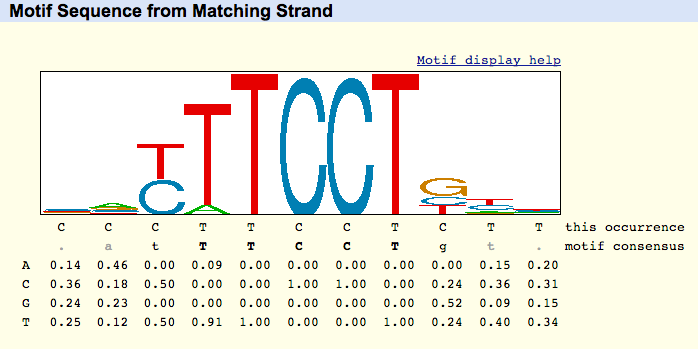

```{r setup, include=FALSE}
knitr::opts_chunk$set(
  echo = TRUE, 
  dpi = 300, 
  fig.height = 4, 
  fig.width = 7,
  fig.align = "center"
)

## general packages
library("dplyr")
library("stringr")

## data viz
library("ggplot2")
library("ComplexHeatmap")
library("ggpubr")
library("RColorBrewer")

## ATAC-seq
library("edgeR")
library("GenomicRanges")
library("ChIPseeker")
library("rGREAT")
library("TxDb.Hsapiens.UCSC.hg19.knownGene")
library("org.Hs.eg.db")


# project path
projectPath <- getwd() 
source(file.path(projectPath, "src", "helperFunctions.R"))
```


## Introduction 

In this practical exercise, we are going to perform some of the possible downstream analyses after detecting accessible peaks in our data. To do so, we are going to analyze the processed data provided by the authors of the data we analyzed in the previous exercise ([paper](https://www.nature.com/articles/ng.3646)). In particular, we are going to download the data deposited in GEO ([GSE74912](https://www.ncbi.nlm.nih.gov/geo/query/acc.cgi?acc=GSE74912)). We need to download the file containing the accessibility matrix. In addition, we are going to analyze only those samples corresponding to CD8+ and CD4+ T cells.

## Loading data

```{r}
dataPath <- file.path(projectPath, "data", "02-data")
```

```{r}
rawCounts <- data.table::fread(
  file.path(dataPath, "GSE74912_ATACseq_All_Counts.txt.gz")
)
peaks.IDs <- paste(rawCounts$Chr, rawCounts$Start, rawCounts$End, sep = "_")
rawCounts <- rawCounts[, -c(1, 2, 3)] %>% as.matrix()
```

```{r}
rawCounts.int <- rawCounts[, colnames(rawCounts) %>% grep("CD[48]", ., value = T)]
rownames(rawCounts.int) <- peaks.IDs
```

```{r}
samplesMetadata <- data.frame(
  SampleID = colnames(rawCounts.int),
  Donor.ID = colnames(rawCounts.int) %>% 
    str_split_i("-", 1) %>% str_remove("Donor") %>% as.character(),
  CellType = colnames(rawCounts.int) %>% str_split_i("-", 2),
  Rep = colnames(rawCounts.int) %>% str_split_i("-", 3)
) %>% mutate(
  Condition = paste0(Donor.ID, CellType, sep = "-")
)
```


## Generating consensus peak set

This matrix is the product of computing a consensus peak set. In order to keep only those peaks with a minimum accessibility within the CD4+ and CD8+ T cell samples, we can apply some filters: 

```{r}
min.counts <- 5
min.samples <- 5
cd4.ids <- rowSums(
  rawCounts.int[, grep("CD4", colnames(rawCounts.int), value = T)] >= min.counts
) == min.samples
cd8.ids <- rowSums(
  rawCounts.int[, grep("CD8", colnames(rawCounts.int), value = T)] >= min.counts
) == min.samples

consensus.peak <- intersect(
  names(cd8.ids)[cd8.ids], names(cd4.ids)[cd4.ids] 
)
rawCounts.int <- rawCounts.int[consensus.peak, ]
```

```{r}
dim(rawCounts.int)
```

## Normalize data using CPM + TMM

This is the same transformation we used in bulk RNA-seq data. Think that the kind of data is the same: counts from sequencing data.

```{r}
## log-cpm + tmm
DGEfiltData <- DGEList(
  counts = rawCounts.int,
  samples = samplesMetadata,
  group = samplesMetadata$Condition
)
DGEfiltData <- calcNormFactors(DGEfiltData, method = "TMM")
lcpmTMM <- cpm(DGEfiltData, log = TRUE)
```

We can also explore the scaling factors computed by TMM: 

```{r, fig.height=7, fig.width=7}
ha <- rowAnnotation(
  df = samplesMetadata %>% dplyr::select(
    CellType, Donor.ID, Rep
  ),
  col = list(
    CellType = color.list()[1:length(unique(samplesMetadata$CellType))] %>% 
      setNames(unique(samplesMetadata$CellType)),
    Donor.ID = color.list()[1:length(unique(samplesMetadata$Donor.ID))] %>% 
      setNames(unique(samplesMetadata$Donor.ID)),
    Condition = color.list()[1:length(unique(samplesMetadata$Condition))] %>% 
      setNames(unique(samplesMetadata$Condition)),
    Rep = color.list()[1:length(unique(samplesMetadata$Rep))] %>% 
      setNames(unique(samplesMetadata$Rep))
  )
)
Heatmap(
  DGEfiltData$samples[, "norm.factors", drop = FALSE],
  name = "Norm. factors", #title of legend,
  row_title = "Samples",
  row_names_gp = gpar(fontsize = 7),
  column_title_gp = gpar(fontsize = 11, fontface = "bold"),
  show_column_names = FALSE,
  heatmap_width = unit(100, "mm"),
  column_title = "Norm. factors from TMM model",
  cell_fun = function(j, i, x, y, width, height, fill) {
    if(DGEfiltData$samples[, "norm.factors", drop = FALSE][i, j] < 1) {
      grid.text(
        sprintf("%.2f", DGEfiltData$samples[, "norm.factors", drop = FALSE][i, j]), x, y, 
        gp = gpar(fontsize = 8, col = "white")
      )  
    } else {
      grid.text(
        sprintf("%.2f", DGEfiltData$samples[, "norm.factors", drop = FALSE][i, j]), x, y, 
        gp = gpar(fontsize = 8, col = "black")
      )
    }
  },
  right_annotation = ha,
  border = T
)
```

## Correlation matrix

This correlation matrix is based on peaks: 

```{r, fig.height=7, fig.width=14}
cor.res <- cor(lcpmTMM, method = "spearman")
cor.res %>% Heatmap(
  name = "Spearman correlation between samples", #title of legend,
  row_title = "Samples",
  row_names_gp = gpar(fontsize = 7),
  column_title_gp = gpar(fontsize = 11, fontface = "bold"),
  show_column_names = FALSE,
  cell_fun = function(j, i, x, y, width, height, fill) {
    grid.text(
      sprintf("%.2f", cor.res[i, j]), x, y, 
      gp = gpar(fontsize = 8, col = "black")
    )  
  },
  right_annotation = ha,
  border = T
)
```


## Multivariate analysis

Let's generate some plots to check how good the data are in terms of reproducibility between replicates. 

```{r}
pca <- prcomp(scale(t(lcpmTMM)), center = FALSE, scale = FALSE)
percent <- pca$sdev[1:2]^2 / sum(pca$sdev^2) * 100
percent <- as.character(round(percent, 2))

dat <- samplesMetadata %>% mutate(
  PC1 = pca$x[SampleID, 1],
  PC2 = pca$x[SampleID, 2]
)
```


```{r, fig.height=4, fig.width=15}
p1 <- ggplot(dat, aes(PC1, PC2)) + 
  geom_point(size = 3.5, aes(colour = Donor.ID)) + 
  labs(
    x = paste0("PC1 (", percent[1], "%)"), y = paste0("PC2 (", percent[2], "%)")
  ) +
  ggtitle("PCA by Donor.ID") + 
  scale_colour_manual(values = color.list()) + 
  theme_bw() + theme(plot.title = element_text(face = "bold"))

p2 <- ggplot(dat, aes(PC1, PC2)) + 
  geom_point(size = 3.5, aes(colour = CellType)) + 
  labs(
    x = paste0("PC1 (", percent[1], "%)"), y = paste0("PC2 (", percent[2], "%)")
  ) +
  ggtitle("PCA by cell type") + 
  scale_colour_manual(values = color.list()) + 
  theme_bw() + theme(plot.title = element_text(face = "bold"))

p3 <- ggplot(dat, aes(PC1, PC2)) + 
  geom_point(size = 3.5, aes(colour = Rep)) + 
  labs(
    x = paste0("PC1 (", percent[1], "%)"), y = paste0("PC2 (", percent[2], "%)")
  ) +
  ggtitle("PCA by sample ID") + 
  scale_colour_manual(values = color.list()) + 
  theme_bw() + theme(plot.title = element_text(face = "bold"))

ggarrange(
  plotlist = list(p1, p2, p3), 
  labels = LETTERS[1:4], align = "hv",
  ncol = 3, nrow = 1
)
```

Both the donor and the cell type seem to play a role in the variability of the data. Therefore, we should take this information into account during statistical analyses. 

## Annotating peaks 

To annotate peaks, we are going to use the [`ChIPseeker`](https://www.bioconductor.org/packages/devel/bioc/vignettes/ChIPseeker/inst/doc/ChIPseeker.html) R package. Besides `ChIPseeker`, there are other options equally valid such as [`HOMER`](http://homer.ucsd.edu/homer/motif/) or [`ChIPpeakAnno`](https://bioconductor.org/packages/release/bioc/html/ChIPpeakAnno.html). 

In R, BioConductor offers several packages and classes to handle data in form of genomic intervals. The most relevant is the `GenomicRanges` package, which contains several handy functions. We need to use this kind of object to use `ChIPseeker`:

```{r}
granges.peaks <- paste0(
  rownames(rawCounts.int) %>% str_split_i("_", 1), ":", 
  paste(
    rownames(rawCounts.int) %>% str_split_i("_", 2), 
    rownames(rawCounts.int) %>% str_split_i("_", 3), 
    sep = "-"
  )
) %>% GRanges()
values(granges.peaks) <- DataFrame(lcpmTMM)
granges.peaks
```

Now, we can use the `annotatePeak` function to annotate peaks to the nearest gene: 

```{r}
peaks.annotated <- annotatePeak(
  granges.peaks, TxDb = TxDb.Hsapiens.UCSC.hg19.knownGene
)
```

And use some built-in functions to inspect the results: 

```{r}
plotAnnoPie(peaks.annotated)
```

```{r}
plotAnnoBar(peaks.annotated)
```

```{r}
upsetplot(peaks.annotated)
```

In addition, we can explore specific genes. For instance: 

```{r}
granges.annotated <- peaks.annotated@anno

values(granges.annotated) <- cbind(
  values(granges.annotated),
  AnnotationDbi::select(
    org.Hs.eg.db,
    keys = granges.annotated$geneId,
    columns = c("SYMBOL"),
    keytype = "ENTREZID"
  ) %>% mutate(
    ENTREZID = ENTREZID %>% as.character()
  )
)
## CD3E: one of genes making up the TCR
values(granges.annotated) %>% as.data.frame() %>% 
  filter(SYMBOL == "CD3E")
```

## Differential accessibility analysis

Now that we know which gene each peak corresponds to, we can identify which peaks are different between cell types and check the genes they are close to. Any tool meant to work on bulk RNA-seq should be valid for this kind of analysis. Here, we are going to use `limma` again, although it is very common to use `DESeq2` or `edgeR` as well due to the higher number of features and the multiple testing matter. 

```{r}
## matrix design
mDesign <- with(samplesMetadata, model.matrix(~ 0 + CellType + Donor.ID))
rownames(mDesign) <- samplesMetadata$SampleID
## fit model
DGE.Voom <- voom(DGEfiltData, mDesign, plot = T)
fit <- lmFit(DGE.Voom, mDesign)

contr <- makeContrasts(CellTypeCD8 - CellTypeCD4, levels = colnames(mDesign))

resList <- contrasts.fit(fit, contrast = contr)
resList <- eBayes(resList)
```


```{r}
all.dea <- topTable(resList, n = Inf) %>% mutate(Loc = rownames(resList)) %>% 
  left_join(
    values(granges.annotated) %>% as.data.frame() %>% 
    dplyr::select(annotation, SYMBOL) %>% mutate(
      Peak.ID = paste(
        seqnames(granges.annotated), start(granges.annotated), 
        end(granges.annotated), sep = "_"
      )
    ), by = join_by(Loc == Peak.ID)
  )
```

Now, we can explore the results and see which genes are close to peaks more accessible in each condition: 

```{r}
plotPvalDist(all.dea, title = "Distribution of pvalues [CD8+ T cells vs CD4+ T cells]")
```


```{r}
all.dea %>% filter(adj.P.Val <= 0.05, logFC >= 1.5) %>% 
  arrange(desc(logFC)) %>% head(10) %>% 
  dplyr::select(logFC, adj.P.Val, Loc, annotation, SYMBOL)
```

```{r}
all.dea %>% filter(adj.P.Val <= 0.05, logFC <= -1.5) %>% 
  arrange(logFC) %>% head(10) %>% 
  dplyr::select(logFC, adj.P.Val, Loc, annotation, SYMBOL)
```

We can use a type of representation called MA plot. This is another way to represent differences between tow conditions very popular with epigenomics data. The idea is to represent the logFC and the average abundance in a scatter plot. Therefore, each point is a different peak and they are colored according to some cutoffs (adjusted p-value and logFC). 

```{r}
th.pval <- 0.05
col.points <- "#45824a"
col.sig <- "#e68337"
th.fold <- 1
```


```{r}
res.sig <- all.dea %>% filter(adj.P.Val <= th.pval, abs(logFC) >= th.fold) 
res.not <- all.dea[!rownames(all.dea) %in% rownames(res.sig), ]
idx <- nrow(res.sig)

xmin <- floor(min(log2(all.dea$AveExpr)))
xmax <- ceiling(max(log2(all.dea$AveExpr)))
ymin <- floor(min(all.dea$logFC))
ymax <- ceiling(max(all.dea$logFC))
smoothScatter(
  log2(res.not$AveExpr),
  res.not$logFC,
  pch = 20,
  cex = 0.2, 
  col = col.points,
  colramp = colorRampPalette(c("white", col.points)),                      
  xaxp = c(xmin, xmax, xmax - xmin),
  xlim = c(xmin, xmax),
  xlab = 'log concentration',
  yaxp = c(ymin, ymax, (ymax - ymin)), 
  ylim = c(ymin, ymax),
  ylab = sprintf('log fold change'),
  main = sprintf(
    '%s (%s peaks, padj <= %1.2f, abs(logFC) >= %1.2f)',
    "CD8 vs CD4 T cells", sum(idx), th.pval, th.fold
  )
)
points(
  log2(res.sig$AveExpr), res.sig$logFC, pch = 20, cex = 0.2, col = col.sig
)
abline(h = 0, col = 'dodgerblue')
```

## Enrichment analysis

Likewise RNA-seq, we could know try to understand the biological functions (understanding biological functions as sets of genes with some kind of association) that the changing peaks are associated with. To my knowledge, there are two ways to do so: 

* As we have already computed with association between peaks and genes, we can now use the gene IDs to check if among those peaks more accessible in a condition there is an enrichment of specific genes. We oculd use ORA or GSEA to do so. 
* Using [`GREAT`](https://www.bioconductor.org/packages/release/bioc/html/rGREAT.html), which does the same but trying to consider an important when working with genomic sequences and regions: the background regions. Instead of generating a background at the gene level (which is what we would be doing in the previous approach), it generates a background from the sequences. In principle, this approach should be more accurate. 

Let's use then the `rGREAT` R package to do this analysis. It needs a `GRanges` object as input. Let's create two objects corresponding to the genomic regions statistically different between CD8+ and CD4+ T cells: 

```{r}
peaks.diff.CD8 <- all.dea %>% filter(logFC >= 1, adj.P.Val <= 0.05) %>% pull(Loc)
granges.CD8 <- paste0(
  peaks.diff.CD8 %>% str_split_i("_", 1), ":", 
  paste(
    peaks.diff.CD8 %>% str_split_i("_", 2), 
    peaks.diff.CD8 %>% str_split_i("_", 3), 
    sep = "-"
  )
) %>% GRanges()
granges.CD8
```

```{r}
peaks.diff.CD4 <- all.dea %>% filter(logFC <= -1, adj.P.Val <= 0.05) %>% pull(Loc)
granges.CD4 <- paste0(
  peaks.diff.CD4 %>% str_split_i("_", 1), ":", 
  paste(
    peaks.diff.CD4 %>% str_split_i("_", 2), 
    peaks.diff.CD4 %>% str_split_i("_", 3), 
    sep = "-"
  )
) %>% GRanges()
granges.CD4
```


```{r}
enrichment.res.CD8 <- great(granges.CD8, "MSigDB:H", "txdb:hg19")
enrichment.res.CD4 <- great(granges.CD4, "MSigDB:H", "txdb:hg19")
```

Now, we can explore the results. The package provides several functions to understand the associations between peaks and genes: 

```{r, fig.height=5, fig.width=14}
plotRegionGeneAssociations(enrichment.res.CD8)
```

And we can check the enrichment results: 

```{r}
getEnrichmentTable(enrichment.res.CD8) %>% filter(p_adjust <= 0.05) %>% arrange(desc(fold_enrichment)) %>% head()
```

Let's make a couple of plots just to check how the results look like: 

```{r}
getEnrichmentTable(enrichment.res.CD4) %>% filter(p_adjust <= 0.05) %>% 
  arrange(desc(fold_enrichment)) %>% 
  ggplot(aes(x = fold_enrichment, y = reorder(id, fold_enrichment), fill = p_adjust)) + 
  geom_bar(stat = "identity") + 
  scale_fill_viridis_c(option = "rocket", direction = -1) + 
  theme_classic()
```


```{r}
getEnrichmentTable(enrichment.res.CD8) %>% filter(p_adjust <= 0.05) %>% 
  arrange(desc(fold_enrichment)) %>% 
  ggplot(aes(x = fold_enrichment, y = reorder(id, fold_enrichment), fill = p_adjust)) + 
  geom_bar(stat = "identity") + 
  scale_fill_viridis_c(option = "rocket", direction = -1) + 
  theme_classic()
```

## Motif enrichment analysis with `HOMER`

Now that we have identified regions with different accessibility levels between the two conditions, we can perform motif enrichment analysis to check if there are differences between the two set of regions. We are going to use `HOMER`, a classic tool written in Perl that is still extensively used. As usual, there are many alternative tools, see below for some examples. 

The command that we are going to use is `findMotifsGenome.pl`, which needs: 

* A BED file with the regions of interest. 
* The genome version used. In this case, it is `hg19`. 
* `-size`: this tells `HOMER` the size of the regions we expect to find. For ATAC-seq, a size of 150-200pb is reasonable, but let's see the size of the regions provided by the authors to be as accurate as possible.

```{r}
dist.diff <- all.dea %>% mutate(
  start = Loc %>% str_split_i("_", 2) %>% as.numeric(),
  end = Loc %>% str_split_i("_", 3) %>% as.numeric(),
  diff = end - start
) %>% pull(diff) 
summary(dist.diff)
```

It seems that the authors provided regions of 500pb. Therefore, let's use this value for `HOMER`.

### Generate input files

The first thing is to generate the BED files for those peaks more accessible in CD8+ T cells and CD4+ T cells. `HOMER` accepts the following format:

HOMER peak files should have at minimum 5 columns (separated by TABs, additional columns will be ignored):

* Column1: Unique Peak ID
* Column2: chromosome
* Column3: starting position
* Column4: ending position
* Column5: Strand (+/- or 0/1, where 0="+", 1="-")

```{r}
## cd8+ t cells
all.dea %>% filter(logFC >= 1, adj.P.Val <= 0.05) %>% dplyr::select(Loc) %>% 
  mutate(
    chr = Loc %>% str_split_i("_", 1),
    start = Loc %>% str_split_i("_", 2),
    end = Loc %>% str_split_i("_", 3),
    strand = "+" ## arbitrary, homer will look for motifs in both strands
  ) %>% write.table(
    x = ., file = file.path(dataPath, "acc-peaks-CD8Tcells.bed"), sep = "\t",
    row.names = FALSE, col.names = FALSE, quote = FALSE
  )
```

```{r}
## cd4+ t cells
all.dea %>% filter(logFC <= -1, adj.P.Val <= 0.05) %>% dplyr::select(Loc) %>% 
  mutate(
    chr = Loc %>% str_split_i("_", 1),
    start = Loc %>% str_split_i("_", 2),
    end = Loc %>% str_split_i("_", 3),
    strand = "+" 
  ) %>% write.table(
    x = ., file = file.path(dataPath, "acc-peaks-CD4Tcells.bed"), sep = "\t",
    row.names = FALSE, col.names = FALSE, quote = FALSE
  )
```

### Run motif enrichment analysis

With these files, we can now run `findMotifsGenome.pl`:

```{bash, eval = FALSE}
conda activate atac-seq-env

findMotifsGenome.pl acc-peaks-CD4Tcells.bed hg19 homer.output/CD4.T.cells -size 500 -mask -p 6
findMotifsGenome.pl acc-peaks-CD8Tcells.bed hg19 homer.output/CD8.T.cells -size 500 -mask -p 6
```

**Note**: it might take a while. If it is too much, I can give you the results. 

This will generate different files and an HTML report to easily explore the results. In particular, `findMotifsGenome.pl` has conducted two types of analyses:

* Known motif enrichment analysis (`knownResults.html`): using an internal database of motifs, `HOMER` checks if there is an enrichment of them in the regions provided in the BED file.  
* Discovery of motifs (`homerResults.html`): it checks the regions provided in the BED file and checks if there are over-represented sequences. Then, it checks if these motifs are similar to the ones in its internal database. 

In this case, as we are analyzing relatively close cell types, the results are very similar: we find transcription factors important for T cell differentiation and function.

### Comments on motifs and other enrichment tools

Motifs are short, recurring sequences of DNA that are often recognized by specific transcription factors (TFs) to regulate gene expression. They can be referred in the literature to as regulatory sequences or cis-regulatory elements. These motifs play critical roles in understanding how genes are turned on or off in various biological contexts. 

To computationally work with them, we use Position Weight Matrices (PWMs), which are mathematical representations of motifs that capture the probability of each nt occurring at each position in the sequence. PWMs are widely used to scan genomic regions to predict potential binding sites for transcription factors. A motif can also be displayed graphically as a sequence logo, where the height of each letter is proportional to its frequency at that particular position, but the total height represents the mutual information content (see slides). 



There are different public collections of motifs available on the internet. When using `HOMER`, it uses an internal database which can be not comprehensive as expected. There are other collections that might be interesting to use coupled with other software to find motifs such as: 

* [JASPAR](https://jaspar.elixir.no/): it contains non-redundant motifs for different organisms. In addition, there are R packages to easily access it: <https://bioconductor.org/packages/release/data/annotation/html/JASPAR2024.html>.
* [CIS-BP](https://cisbp.ccbr.utoronto.ca/).
* [HOCOMOCO](https://hocomoco11.autosome.org/): it is specialized in human and mouse motifs. 
* [HOMER](http://homer.ucsd.edu/homer/motif/)

Regarding additional tools that might be worth exploring, here you have some of them: 

* [`monaLisa`](https://www.bioconductor.org/packages/release/bioc/html/monaLisa.html): it implements a different way to perform motif enrichment analysis. 
* [`motifmatchr`](https://greenleaflab.github.io/motifmatchr/#:~:text=motifmatchr%20is%20an%20R%20package,been%20included%20in%20this%20repository.): it is a matching motif tool.
* [`rGADEM`](https://bioconductor.org/packages/release/bioc/html/rGADEM.html) for de novo discovery of motifs.
* [`memes`](https://www.bioconductor.org/packages/release/bioc/html/memes.html): this is an R package that serves as connection with the MEME suite, a software to perform several analyses related to epigenomics. I strongly recommend you to check it out: <https://meme-suite.org/meme/>. 
* [`GimmeMotifs`](https://github.com/vanheeringen-lab/gimmemotifs/tree/master): this one is in Python. The point is that it contains a collection of motifs from different databases. 

In R, there are specific ways to work with motifs. Again, this is just to let you know that you can use the [`TFBSTools`](https://bioconductor.org/packages/release/bioc/html/TFBSTools.html) or the [`universalmotif`](https://bioconductor.org/packages/release/bioc/html/universalmotif.html) R packages to represent motifs and load them into some of the packages explained above. 


